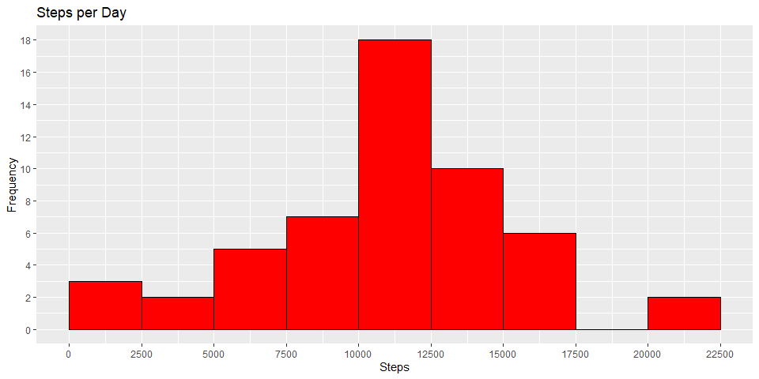
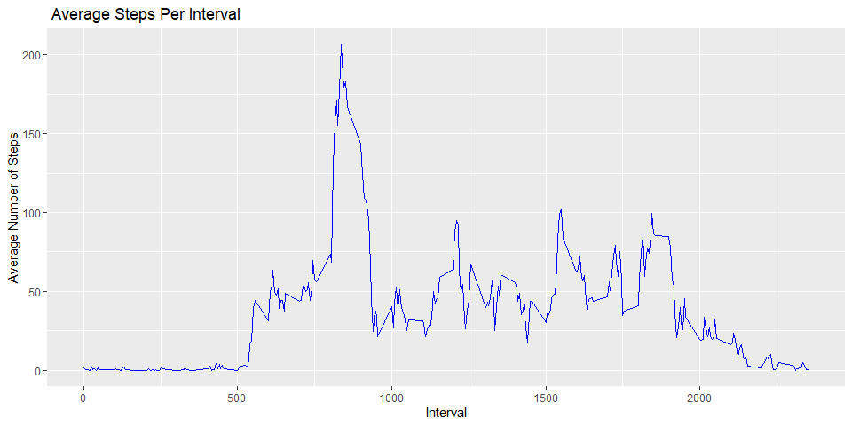
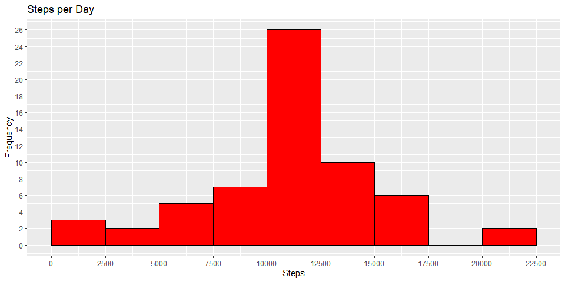
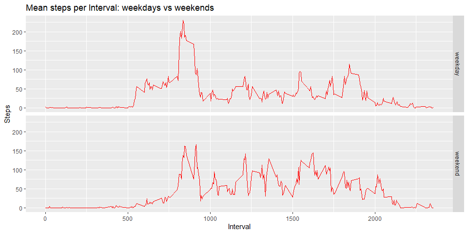

## Introduction

It is now possible to collect a large amount of data about personal
movement using activity monitoring devices such as a
[Fitbit](http://www.fitbit.com), [Nike
Fuelband](http://www.nike.com/us/en_us/c/nikeplus-fuelband), or
[Jawbone Up](https://jawbone.com/up). These type of devices are part of
the "quantified self" movement -- a group of enthusiasts who take
measurements about themselves regularly to improve their health, to
find patterns in their behavior, or because they are tech geeks. But
these data remain under-utilized both because the raw data are hard to
obtain and there is a lack of statistical methods and software for
processing and interpreting the data.

This assignment makes use of data from a personal activity monitoring
device. This device collects data at 5 minute intervals through out the
day. The data consists of two months of data from an anonymous
individual collected during the months of October and November, 2012
and include the number of steps taken in 5 minute intervals each day.
## Data

The data for this assignment can be downloaded from the course web
site:

* Dataset: [Activity monitoring data](https://d396qusza40orc.cloudfront.net/repdata%2Fdata%2Factivity.zip) [52K]

The variables included in this dataset are:

* **steps**: Number of steps taking in a 5-minute interval (missing
    values are coded as `NA`)

* **date**: The date on which the measurement was taken in YYYY-MM-DD
    format

* **interval**: Identifier for the 5-minute interval in which
    measurement was taken


The dataset is stored in a comma-separated-value (CSV) file and there
are a total of 17,568 observations in this
dataset.

## Loading and preprocessing the data
Show any code that is needed to

1. Load the data (i.e. `read.csv()`)

2. Process/transform the data (if necessary) into a format suitable for your analysis

```r
#loading the libraries
library(ggplot2)
library(dplyr)
```
# unzipping and reading the file

```r
unzip("./activity.zip")
activity <- read.csv("./activity.csv")
#How the data iniatially looks like:
activity$date<-as.Date(activity$date)
summary(activity)
```

```
##      steps             date               interval     
##  Min.   :  0.00   Min.   :2012-10-01   Min.   :   0.0  
##  1st Qu.:  0.00   1st Qu.:2012-10-16   1st Qu.: 588.8  
##  Median :  0.00   Median :2012-10-31   Median :1177.5  
##  Mean   : 37.38   Mean   :2012-10-31   Mean   :1177.5  
##  3rd Qu.: 12.00   3rd Qu.:2012-11-15   3rd Qu.:1766.2  
##  Max.   :806.00   Max.   :2012-11-30   Max.   :2355.0  
##  NA's   :2304
```


## What is mean total number of steps taken per day?


For this part of the assignment, you can ignore the missing values in the dataset.
1. Calculate the total number of steps taken per day

```r
StepsPerDay<-aggregate(steps~date,activity, sum,na.rm = T)
colnames(StepsPerDay)<-c("date","steps")
```
2. Make a histogram of the total number of steps taken each day

```r
g<-ggplot(StepsPerDay,aes(steps))
g + geom_histogram(boundary = 0,binwidth = 2500,col = "black",fill = "red") + scale_x_continuous(breaks = seq(0,25000,2500))+
    scale_y_continuous(breaks = seq(0,20,2)) + ggtitle("Steps per Day") + xlab("Steps") + ylab("Frequency")
```

<!-- -->
3. Calculate and report the mean and median total number of steps taken per day

```r
mean(StepsPerDay$steps)
```

```
## [1] 10766.19
```

```r
median(StepsPerDay$steps)
```

```
## [1] 10765
```

## What is the average daily activity pattern?
1. Make a time series plot (i.e. type = “l”) of the 5-minute interval (x-axis) and the average number of steps taken, averaged across all days (y-axis)


```r
StepsPerInter<-aggregate(steps~interval,activity, mean,na.rm=T)
head(StepsPerInter)
```

```
##   interval     steps
## 1        0 1.7169811
## 2        5 0.3396226
## 3       10 0.1320755
## 4       15 0.1509434
## 5       20 0.0754717
## 6       25 2.0943396
```

```r
g<-ggplot(StepsPerInter,aes(interval,steps))
g + geom_line(col = "blue") + ylab("Average Number of Steps") + xlab("Interval") + ggtitle(" Average Steps Per Interval")
```

<!-- -->
2. Which 5-minute interval, on average across all the days in the dataset, contains the maximum number of steps?

```r
StepsPerInter[which.max(StepsPerInter$steps),]$interval
```

```
## [1] 835
```


## Imputing missing values
1. Calculate and report the total number of missing values in the dataset (i.e. the total number of rows with NAs)

```r
sum(is.na(activity$steps))
```

```
## [1] 2304
```
2. Devise a strategy for filling in all of the missing values in the dataset. The strategy does not need to be sophisticated. For example, you could use the mean/median for that day, or the mean for that 5-minute interval, etc.

```r
ImpSteps <- round(StepsPerInter$steps[match(activity$interval, StepsPerInter$interval)])
```
3. Create a new dataset that is equal to the original dataset but with the missing data filled in.

```r
ImpActivity<-transform(activity,steps = ifelse(is.na(activity$steps),yes = ImpSteps,no = activity$steps))
head(ImpActivity)
```

```
##   steps       date interval
## 1     2 2012-10-01        0
## 2     0 2012-10-01        5
## 3     0 2012-10-01       10
## 4     0 2012-10-01       15
## 5     0 2012-10-01       20
## 6     2 2012-10-01       25
```
4. Make a histogram of the total number of steps taken each day and Calculate and report the mean and median total number of steps taken per day. Do these values differ from the estimates from the first part of the assignment? What is the impact of imputing missing data on the estimates of the total daily number of steps?

```r
TotalImp<-aggregate(steps~date,ImpActivity,sum)

g<-ggplot(TotalImp,aes(steps))
g + geom_histogram(boundary = 0,binwidth = 2500,col = "black",fill = "red") + scale_x_continuous(breaks = seq(0,25000,2500))+
    scale_y_continuous(breaks = seq(0,26,2)) + ggtitle("Steps per Day") + xlab("Steps") + ylab("Frequency")
```

<!-- -->

```r
mean(TotalImp$steps)
```

```
## [1] 10765.64
```

```r
median(TotalImp$steps)
```

```
## [1] 10762
```


## Are there differences in activity patterns between weekdays and weekends?
For this part the weekdays() function may be of some help here. Use the dataset with the filled-in missing values for this part.
1. Create a new factor variable in the dataset with two levels - “weekday” and “weekend” indicating whether a given date is a weekday or weekend day.

```r
ImpActivity$day<-weekdays(ImpActivity$date)
ImpActivity$daytype<-ifelse(ImpActivity$day == 'Sunday'|ImpActivity$day == 'Saturday','weekend','weekday')
head(ImpActivity)
```

```
##   steps       date interval    day daytype
## 1     2 2012-10-01        0 Monday weekday
## 2     0 2012-10-01        5 Monday weekday
## 3     0 2012-10-01       10 Monday weekday
## 4     0 2012-10-01       15 Monday weekday
## 5     0 2012-10-01       20 Monday weekday
## 6     2 2012-10-01       25 Monday weekday
```
2. Make a panel plot containing a time series plot (i.e. type = “l”) of the 5-minute interval (x-axis) and the average number of steps taken, averaged across all weekday days or weekend days (y-axis).

```r
DtActivity<-aggregate(steps~interval+ daytype, ImpActivity,mean)
i<-ggplot(DtActivity,aes(interval,steps))
i+geom_line(col = 'red')+ xlab('Interval') + ylab("Steps")+ ggtitle("Mean steps per Interval: weekdays vs weekends") +
    facet_grid(daytype~.)
```

<!-- -->
